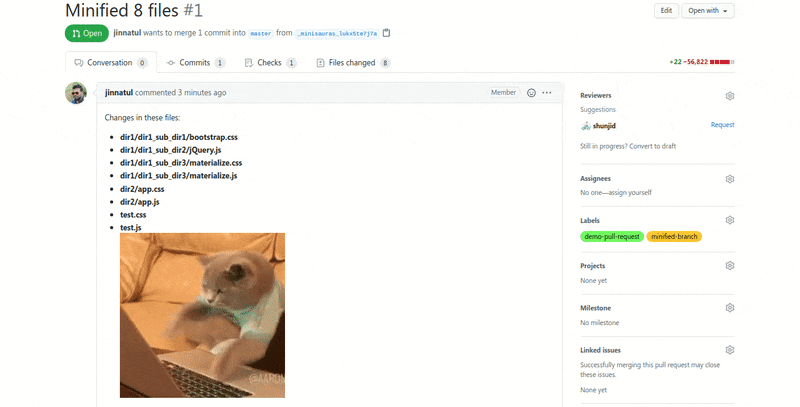

<div align="center">


[](https://dev.to/_shunjid/minisauras-a-github-action-to-minify-css-and-js-files-34b9)
[](https://hits.seeyoufarm.com)

</div>


# Minisauras :tada:
Minisauras is an open-source CI/CD automation tool based on :octocat: [**GitHub Actions**](https://github.com/features/actions) that pulls all the JavaScript and CSS files from your base branch, minify them and creates a pull-request with a new branch. 

## How it works
- Traverse through a given directory (if not provided, traverse from root), finds all the JavaScript & CSS files within it and it's sub-directories. 
- Afterwards, **Minisauras** minify all those files.
- Finally, it creates a new branch in your repository, push those changes and creates a pull request that can be merged in your base branch.

## Usage
- Create a [personal access token](https://docs.github.com/en/github/authenticating-to-github/creating-a-personal-access-token).
- Then [setup a secret](https://docs.github.com/en/actions/configuring-and-managing-workflows/creating-and-storing-encrypted-secrets) using that personal access token in your desired repository.
- Create a workflow. For example: **main.yml** under (.github/workflows) directory.
- In the workflow, provide following things:
    * Personal access token. For example: ${{ secrets.TOKEN }} if you set your secret with a name 'TOKEN'.
    * The desired directory in which you want to minify CSS and JS files. For example: './' for root and 'src/' for src directory.

## Examples

_**If you want to minify all your JS and CSS files under root directory**_

```yml
name: minisauras

on: [push]

jobs:
  read:
    runs-on: ubuntu-18.04

    steps:
    - name: Checkout
      uses: actions/checkout@v2
    - name: minisauras
      uses: TeamTigers/minisauras@v1.0.0
      env:
        GITHUB_TOKEN: ${{ secrets.TOKEN }}
      id: dir
      with:
        directory: './' ## minify all files from root directory
```


_**If you want to minify all your JS and CSS files under your custom directory ex. assets/js & assets/css**_

```yml
name: minisauras

on: [push]

jobs:
  read:
    runs-on: ubuntu-18.04

    steps:
    - name: Checkout
      uses: actions/checkout@v2
    - name: minisauras
      uses: TeamTigers/minisauras@v1.0.0
      env:
        GITHUB_TOKEN: ${{ secrets.TOKEN }}
      id: dir
      with:
        directory: 'assets/' ## minify all files under assets directory
```

## Example Repository

There you go !! We have created an example repository where you can see how minisauras has minified all the CSS and JavaScript files as well as created a new branch and sent a [pull request](https://github.com/TeamTigers/minisauras-example/pull/1).

[](https://github.com/TeamTigers/minisauras-example/)

## License 
This project is licensed under [MIT](LICENSE)

## If you like our work please give it a :star:
